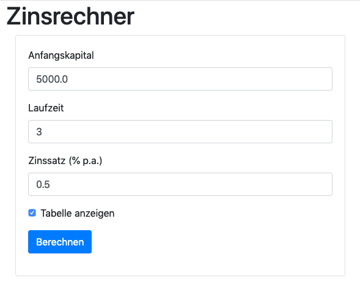

= Softwareentwicklung im Team: Praktische Übung 1
:icons: font
:icon-set: fa
:experimental:
:source-highlighter: rouge
ifdef::env-github[]
:tip-caption: :bulb:
:note-caption: :information_source:
:important-caption: :heavy_exclamation_mark:
:caution-caption: :fire:
:warning-caption: :warning:
:stem: latexmath
endif::[]

== Aufgabe

Wir wollen eine Webanwendung implementieren, die den Zinsertrag für einen angelegten Betrag berechnen kann. Dazu soll ein Formular, das in etwa wie folgt aussieht angezeigt werden.

Wenn das Formular abgeschickt wurde, dann soll das Ergebnis berechnet werden und in etwa wie folgt angezeigt werden (jeweils mit und ohne Tabelle)

image::z2.png[]
image::z3.png[]

Die Daten aus der Eingabe sollen immer im Ergebnis auch mit angezeigt werden. 

Es gibt keine Projektvorgabe. Starten Sie mit dem https://start.spring.io[Spring Initializr] bzw. dem IntelliJ Wizard. Sie benötigen mindestens Spring Web und Thymeleaf, die Verwendung der DevTools ist sicher auch hilfreich.
